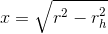

pyballd
=======

A Pseudospectral Elliptic Solver for Axisymmetric Problems Implemented
in Python

# Domain

The appropriate domain for an axisymmetric problem is

where *rh* is some minimum radius. Infinite domains are
difficult to handle. Therefore, following the work of Herdeiro and
Radu [1], we define

and

so that *X* is defined on the domain *[0,1]*. We perform our
differentiation on *X*, which has no effect on the original PDE system
except the introduction of Jacobian terms of the form

in a few places. Since one may want to assume additional (or
different!) symmetry in the longitudinal direction, we do not impose
any restriction there.

# Pseudospectral Derivatives

Pyballd uses Legendre pseudospectral derivatives to attain very high
accuracy with fairly low resolution. For example, if we numerically
take second-order derivatives of this function:

and vary the number of points (or alternatively the maximum order of
Legendre polynomial used for differentiation), we find that our error
decays exponentially with the number of points. This is called
"spectral" or "evanescent" convergence:

# References

[1] Herderio, Radu, Runarrson. Kerr black holes with Proca
hair. *Classical and Quantum Gravity* **33-15** (2016).
