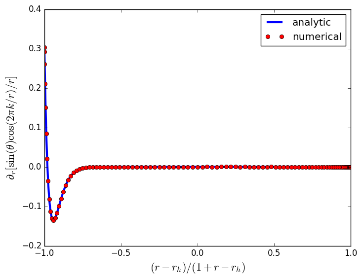
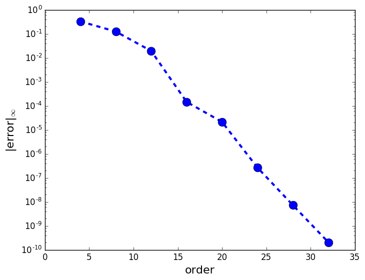

pyballd
=======

Author: Jonah Miller (jonah.maxwell.miller@gmail.com)

A Pseudospectral Elliptic Solver for Axisymmetric Problems Implemented
in Python

# The Basic Idea

In Pyballd, an elliptic system is defined via a *residual.* A residual

acts on a state vector *u* and its first and second derivatives in (in
our case, axisymmetry), *r* and &#952;. If

then *u* is a solution to the PDE.

# Pseudospectral Derivatives

Pyballd uses Legendre pseudospectral derivatives to attain very high
accuracy with fairly low resolution. For example, if we numerically
take second-order derivatives of this function:

and vary the number of points (or alternatively the maximum order of
Legendre polynomial used for differentiation), we find that our error
decays exponentially with the number of points. This is called
"spectral" or "evanescent" convergence:

# Domain

The appropriate domain for an axisymmetric problem is

where *rh* is some minimum radius. Infinite domains are
difficult to handle. Therefore, following the work of Herdeiro and
Radu [1], we define either

for most boundary situations or 

when *rh* is a black hole event horizon. We then define

so that *X* is defined on the domain *[0,1]*. We perform our
differentiation on *X*, which has no effect on the original PDE system
except the introduction of Jacobian terms of the form

in a few places. Since one may want to assume additional (or
different!) symmetry in the longitudinal direction, we do not impose
any restriction there.

## Jacobian for the Compactified Domain

When *x* is defined as 

the Jacobian for the coordinate transformation looks like

The primary advantage is that *1/rn* falloffs are linear in
this coordinate system and so a low-order spectral method will
represent the solution exactly.

## Convergence on the Compactified Domain

For more complex functions, such as this one:

which has this derivative

On the compact domain (on the equator), this function becomes

with derivative

In this setup, our convergence becomes substantially slower. However,
we still retain spectral convergence as this plot of the maximum of
the errors in the derivative of the above function on the
compactified domain shows:

# References

[1] Herderio, Radu, Runarrson. Kerr black holes with Proca
hair. *Classical and Quantum Gravity* **33-15** (2016).
