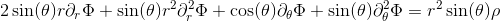
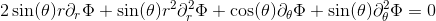

pyballd
=======

Author: Jonah Miller (jonah.maxwell.miller@gmail.com)

A Pseudospectral Elliptic Solver for Axisymmetric Problems Implemented
in Python

# Pseudospectral Derivatives

Pyballd uses Legendre pseudospectral derivatives to attain very high
accuracy with fairly low resolution. For example, if we numerically
take second-order derivatives of this function:


and vary the number of points (or alternatively the maximum order of
Legendre polynomial used for differentiation), we find that our error
decays exponentially with the number of points. This is called
"spectral" or "evanescent" convergence:


# Domain

The appropriate domain for an axisymmetric problem is


where *r<sub>h</sub>* is some minimum radius. Infinite domains are
difficult to handle. Therefore, following the work of Herdeiro and
Radu [1], we define either


for most boundary situations or 


when *r<sub>h</sub>* is a black hole event horizon. We then define


so that *X* is defined on the domain *[0,1]*. We perform our
differentiation on *X*, which has no effect on the original PDE system
except the introduction of Jacobian terms of the form


in a few places. Since one may want to assume additional (or
different!) symmetry in the longitudinal direction, we do not impose
any restriction there.

## Jacobian for the Compactified Domain

When *x* is defined as 


the Jacobian for the coordinate transformation looks like


The primary advantage is that *1/r<sup>n</sup>* falloffs are linear in
this coordinate system and so a low-order spectral method will
represent the solution exactly.

## Convergence on the Compactified Domain

For more complex functions, such as this one:


which has this derivative


On the compact domain (on the equator), this function becomes


with derivative


In this setup, our convergence becomes substantially slower. However,
we still retain spectral convergence as this plot of the maximum of
the errors in the derivative of the above function on the
compactified domain shows:


# Solving an Elliptic PDE

In Pyballd, an elliptic system is defined via a *residual.* A residual


acts on a state vector *u* and its first and second derivatives in (in
our case, axisymmetry) *r* and &#952;. If


then *u(r,&#952;)* is a solution to the PDE system.

An elliptic PDE is not well-posed without the addition of boundary
conditions, which select for the particular solution. At infinity
(*X=1*), we automatically demand that the solution must vanish. (In
other words, we demand that all solutions are square-integrable.)

Dirichlet, Von-Neumann, or Robin boundary conditions can be imposed on
the inner radius (*r_h*), the position of minimum &#952; (often the
axis of symmetry), and the position of maximum &#952; (often the axis
of symmetry or the equator).

In the case of black-hole like compactifications, where


we automatically impose Von-Neumann boundary conditions at the inner
boundary such that


which is a regularity condition we need to impose on solutions in
these coordinates.

## Pyballd's API

Pyballd simply requires that the user pass in functions that vanish
when the residual and boundary conditions are satisfied. Along with
information about the domain, such as the value of *r<sub>h</sub>*,
this is sufficient information to construct a solution. 

## An Example: Poisson's Equation

Poisson's equation is

,

or, in spherical coordinates it is

.

If we assume axisymmetry so that the azimuthal derivatives vanish and
multiply both sides of the equation by the appropriate factors, we
attain

.

For simplicity, we further restrict ourselves to the source-free case and attain

.

We would like to solve this problem using pyballd.

We begin by importing `pyballd` and `numpy`.

```python
import pyballd
import numpy as np
```

`pyballd` expects a residual, which defines the PDE system. The PDE is
satisfied when the residual vanishes. We define ours as

```python
def residual(r,theta,u,d):
    out = (2*r*d(u,1,0)
           + r*r*d(u,2,0)
           + np.cos(theta)*d(u,0,1)
           + np.sin(theta)*d(u,0,2))
    return out
```

Here `d` is a derivative operator. So `d(u,2,0)` corresponds to two
derivatives with respect to *r* of *u*, while `d(u,0,2)` corresponds
to two derivatives with respect to &#952;.

It allso expects a boundary condition for the inner boundary. We
choose a Dirichlet boundary condition and define it as:

```python
k = 2
a = 4
def bdry_X_inner(theta,u,d):
    out = u - a*np.cos(k*theta)
    return out
```

This works a lot like `residual` defined above. However, it will only
be evaluated at the inner boundary. The boundary condition is
satisfied when `bdry_X_inner` vanishes.

Nonlinear elliptic systems are not necessarily unique. (And even
linear ones may be difficult to uniquely solve numerically.)
Therefore, we must feed the solver with an initial guess for the
solution. We define ours as

```python
def initial_guess(r,theta):
    out = a*np.cos(k*theta)/r
    return out
```

which is definitely not the correct solution. However, it should
be sufficiently close to the true solution to allow for convergence.

Finally, we ask `pyballd` to generate a solution by calling
`pyballd.pde_solve_once`. For example:

```python
R,X,THETA,SOLN = pyballd.pde_solve_once(residual,
                                        r_h = 1.0,
                                        order_X = 60,
                                        order_theta = 24,
                                        bdry_X_inner = bdry_X_inner,
                                        initial_guess = initial_guess)
```

`pyballd.pde_solve_once` has a large number of options and
defaults. For a full description of of these, see the help string
associated with it.

After waiting a few minutes, you should get an image like this one:


# References

[1] Herderio, Radu, Runarrson. Kerr black holes with Proca
hair. *Classical and Quantum Gravity* **33-15** (2016).
